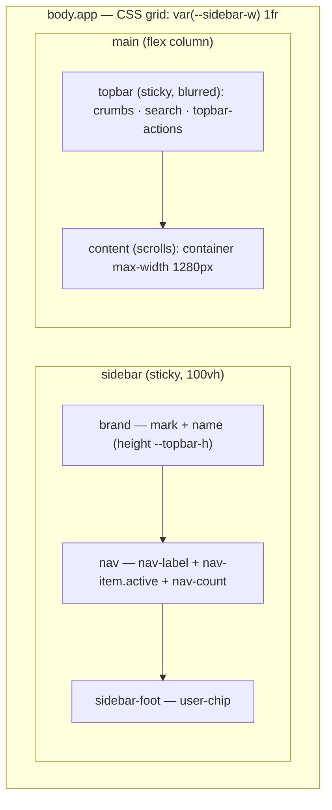

# Floreat Design System

A portable UI/UX reference distilled from the Floreat — Structural Quotation Studio prototype. It is written to be read two ways:

- **By a human** — each section opens with a principle and the reasoning behind it.
- **By an agent** — each section ends with terse, copy-paste **Agent rules** you can paste into a brief.

Every section is **layered**: the portable principle first, then Floreat's concrete values as the worked example. Adopt the *system*; swap the *values* per brand.

> **Source of truth.** The canonical implementation lives in [`assets/app.css`](assets/app.css) (tokens + components) and [`assets/app.js`](assets/app.js) (theming, nav, keyboard, save status). This document explains and generalizes that code; when a value here disagrees with `app.css`, `app.css` wins.

---

## Contents

- [1. Design philosophy](#1-design-philosophy)
- [2. Porting to a new project](#2-porting-to-a-new-project)
- [3. Color system](#3-color-system)
- [4. Typography](#4-typography)
- [5. Spacing, shape & motion](#5-spacing-shape--motion)
- [6. Component library](#6-component-library)
- [7. Interaction & state](#7-interaction--state)
- [8. App shell, IA & responsive](#8-app-shell-ia--responsive)
- [9. Accessibility](#9-accessibility)
- [10. Content & voice](#10-content--voice)
- [11. Adoption checklist](#11-adoption-checklist)
- [Appendix A — machine-readable tokens](#appendix-a--machine-readable-tokens)

---

## 1. Design philosophy

**Principle.** A design system is a *contract*, not a mood board. The contract is the token layer: every color, size, space, radius, shadow, and timing function is named once and referenced everywhere. Components never hold raw values. This is what makes a look portable — you re-skin by editing the contract, not by hunting through component rules.

Four rules carry the whole system:

1. **Tokens are the contract.** No raw hex, no magic pixel values inside component rules. Everything resolves to a `--token` or a `color-mix()` of tokens.
2. **Single accent, used at most twice per screen.** One brand color. The default budget is *one eyebrow/active state + one primary CTA*. Restraint is what reads as "engineered," not "decorated."
3. **Boring over clever, consistent over novel.** A second-best pattern used everywhere beats a brilliant pattern used once. Reach for an existing component before inventing one.
4. **Direction: tech-utility, engineering blue.** Dense but legible, calm surfaces, monospace for anything numeric or label-like. The product should read like precision software, not a marketing page.

**Floreat example.** The direction is literally written into `app.css`'s header comment: *"tech-utility, engineering blue. All color lives in token blocks below — no raw hex in component rules."* The accent is a single engineering blue (`--accent: oklch(54% 0.17 256)`), and it appears on screen only as active nav, primary buttons, focus rings, and accent badges.

> **Agent rules**
> - Never write a hex value inside a component rule. Use a token or `color-mix(in oklch, var(--token) N%, …)`.
> - One accent color per project. On any single screen, use it at most twice.
> - Before adding a component, check [§6](#6-component-library). Adapt the closest existing one rather than inventing.
> - Default to the documented values; deviate only with a stated reason.

---

## 2. Porting to a new project

**Principle.** Re-skinning should be a six-line edit. If adopting the system requires touching component rules, the token layer has leaked and needs fixing first.

**Steps to adopt this system in a fresh project:**

1. **Copy `assets/app.css` and `assets/app.js`** into the new project unchanged.
2. **Swap the six core tokens** in `:root` (see [§3](#3-color-system)) for your brand. Everything derived (`--surface-2/3`, `--accent-soft`, status soft variants) recomputes automatically via `color-mix`.
3. **Adjust the dark theme** `[data-theme="dark"]` block to match — it overrides the same six plus derived surfaces.
4. **Replace the brand mark + name** in the sidebar (`.brand`).
5. **Keep everything else** — typography scale, spacing, radius, shadows, components, shell, responsive tiers. They are brand-neutral by design.
6. **Wire the shell**: include the sidebar + topbar markup and call the `app.js` helpers (theme toggle, mobile nav, save status).

If you only need the *system* and not Floreat's exact palette, treat [§3–§5](#3-color-system) as a template: keep the token *names* and *scale shape*, change the *values*.

> **Agent rules**
> - To re-skin: edit the 6 core `:root` tokens + the dark `[data-theme="dark"]` overrides. Touch nothing else.
> - Keep token names and scale steps identical across projects so components stay portable.

---

## 3. Color system

**Principle.** Build color on a **small core** and *derive* the rest. A six-token core (background, surface, foreground, muted, border, accent) describes any flat UI. Everything else — hover surfaces, soft accent fills, status tints — is a `color-mix` of the core, so re-theming the core re-themes the whole app. Use a perceptual color space (OKLCH) so that equal lightness numbers look equally light across hues, which keeps contrast predictable.

### 3.1 The six-token core

| Token | Role | Floreat (light) |
|---|---|---|
| `--bg` | App background | `oklch(97% 0.004 255)` |
| `--surface` | Cards, panels, raised surfaces | `oklch(100% 0 0)` |
| `--fg` | Primary text | `oklch(24% 0.02 260)` |
| `--muted` | Secondary text, icons | `oklch(52% 0.018 260)` |
| `--border` | Hairlines, dividers | `oklch(91% 0.006 260)` |
| `--accent` | The single brand color | `oklch(54% 0.17 256)` |

### 3.2 Derived surfaces & accent variants

These are *computed from* the core — keep them, they rarely need hand-editing:

| Token | Role | Floreat |
|---|---|---|
| `--surface-2` | Inset rows, table headers | `oklch(98.4% 0.003 260)` |
| `--surface-3` | Hover, code wells | `oklch(96.2% 0.004 260)` |
| `--border-2` | Softer hairline | `oklch(94% 0.005 260)` |
| `--fg-2` | Secondary headings, field labels | `oklch(38% 0.02 260)` |
| `--accent-fg` | Text/icon on accent fill | `oklch(100% 0 0)` |
| `--accent-soft` | Accent tint fill | `color-mix(in oklch, var(--accent) 12%, transparent)` |
| `--accent-line` | Accent-tinted border | `color-mix(in oklch, var(--accent) 40%, var(--border))` |

### 3.3 Status colors

Each status ships a solid color **and** a `-soft` tint (built with `color-mix`) for backgrounds:

| Token | Floreat | `-soft` |
|---|---|---|
| `--success` | `oklch(56% 0.13 155)` | `color-mix(… 14%, transparent)` |
| `--warn` | `oklch(70% 0.14 70)` | `color-mix(… 18%, transparent)` |
| `--danger` | `oklch(57% 0.20 25)` | `color-mix(… 13%, transparent)` |
| `--info` | `oklch(60% 0.12 250)` | — |

### 3.4 The `color-mix` pattern

Soft fills, tinted borders, and translucent overlays are all expressed as mixes of existing tokens rather than new hardcoded colors:

```css
--accent-soft: color-mix(in oklch, var(--accent) 12%, transparent);
--accent-line: color-mix(in oklch, var(--accent) 40%, var(--border));
/* hover on a primary button darkens the accent itself: */
.btn-primary:hover { background: color-mix(in oklch, var(--accent) 88%, black); }
```

This is why swapping `--accent` recolors hovers, soft fills, focus rings, and badges in one move.

### 3.5 Dark theme

**Principle.** Dark mode is a *token override*, not a parallel stylesheet. Override the same six core tokens plus the derived surfaces under a `[data-theme="dark"]` selector; components are untouched.

Floreat's dark overrides (abbreviated — see `app.css` for the full block):

```css
[data-theme="dark"] {
  --bg:      oklch(19% 0.014 262);
  --surface: oklch(23% 0.016 262);
  --fg:      oklch(95% 0.005 260);
  --muted:   oklch(66% 0.016 260);
  --border:  oklch(31% 0.018 262);
  --accent:  oklch(70% 0.14 255);   /* lighter, more legible on dark */
  /* + derived surfaces, status colors, and darker shadow tiers */
}
```

Note two deliberate moves: the accent gets *lighter* in dark mode (a 54% → 70% lightness bump for legibility on dark surfaces), and shadows get *stronger* (`oklch(0% 0 0 / 0.3–0.5)` vs the light theme's subtle tints).

> **Agent rules**
> - Define exactly 6 core tokens; derive everything else with `color-mix`.
> - Every status color needs a `-soft` companion for fills.
> - Dark mode = override core + derived tokens under `[data-theme="dark"]`. Never fork component CSS.
> - In dark mode, raise accent lightness (~+15%) and shadow opacity.
> - Color space is OKLCH throughout. No hex, no `rgb()`.

---

## 4. Typography

**Principle.** Two families, three roles. A **sans** for everything human-readable; a **monospace** for anything that is *data* — numbers, codes, labels, eyebrows, table headers. Mono on data is the single biggest signal that a UI is "engineering-grade": it aligns digits, fixes column widths, and visually separates machine values from prose. Size from a fixed step scale; never type a raw `font-size`.

### 4.1 Families & roles

| Role | Family | Floreat |
|---|---|---|
| Body, headings, UI | Sans | `'Inter', -apple-system, BlinkMacSystemFont, 'Segoe UI', system-ui, sans-serif` |
| Numbers, codes, labels, eyebrows, table headers | Mono | `'JetBrains Mono', 'SF Mono', ui-monospace, 'IBM Plex Mono', Menlo, monospace` |

Helpers: `.num` (mono + `tabular-nums` + tightened tracking) for any figure that should align; `.mono` for the family alone.

### 4.2 Type scale

An 8-step scale covers UI through display:

| Token | px | Typical use |
|---|---|---|
| `--fs-xs` | 11.5 | Eyebrows, badges, table headers, captions |
| `--fs-sm` | 13 | Secondary text, hints, small buttons |
| `--fs-base` | 14 | Body / default UI text |
| `--fs-md` | 15 | Card titles, emphasized body |
| `--fs-lg` | 18 | Sub-headings |
| `--fs-xl` | 22 | Section titles |
| `--fs-2xl` | 28 | Page titles |
| `--fs-3xl` | 36 | KPI values, hero numbers |

### 4.3 Heading & number treatment

```css
h1,h2,h3,h4 { font-weight: 600; letter-spacing: -0.015em; text-wrap: balance; }
p           { text-wrap: pretty; }
.num        { font-family: var(--font-mono); font-variant-numeric: tabular-nums; letter-spacing: -0.01em; }
```

- **Headings**: weight 600 (not 700 — the system favors restraint), negative tracking for a tighter engineered feel, `text-wrap: balance` so multi-line titles don't leave orphans.
- **Page titles** push tracking further (`-0.025em`); **KPI values** further still (`-0.03em`).
- **Numbers**: always `tabular-nums` so columns of figures align.

> **Agent rules**
> - Sans for prose/UI; mono for *all* numerics, codes, labels, eyebrows, and `<th>`.
> - Size only from `--fs-xs … --fs-3xl`. Never write a raw `font-size`.
> - Headings: `font-weight: 600`, negative letter-spacing, `text-wrap: balance`.
> - Wrap any aligned figure in `.num` (mono + tabular-nums).

---

## 5. Spacing, shape & motion

**Principle.** Constrain the continuous dimensions — space, radius, elevation, time — to short discrete scales. A 4pt spacing grid makes every gap a multiple of a base unit, so layouts snap into rhythm without per-element fiddling. One easing curve and a 3-step shadow scale give motion and depth a consistent "hand."

### 5.1 Spacing — 4pt grid

| Token | px | | Token | px |
|---|---|---|---|---|
| `--s1` | 4 | | `--s6` | 24 |
| `--s2` | 8 | | `--s7` | 32 |
| `--s3` | 12 | | `--s8` | 40 |
| `--s4` | 16 | | `--s9` | 56 |
| `--s5` | 20 | | | |

Rules of thumb: `--s2/--s3` inside controls, `--s4/--s5` between elements, `--s6` card padding, `--s7` content padding, `--s9` empty-state breathing room.

### 5.2 Radius

| Token | px | Use |
|---|---|---|
| `--radius-sm` | 6 | Buttons, inputs, nav items, icon buttons |
| `--radius` | 9 | General medium surfaces |
| `--radius-lg` | 14 | Cards |

Pills (badges, switches, status) use `border-radius: 999px`.

### 5.3 Elevation — 3 tiers

```css
--shadow-sm: 0 1px 2px oklch(24% 0.02 260 / 0.06);                 /* resting controls */
--shadow-md: 0 4px 14px …/0.08, 0 1px 3px …/0.06;                  /* popovers, tooltips */
--shadow-lg: 0 16px 40px …/0.16;                                   /* drawers, modals */
```

Shadows are tinted with the foreground hue (not pure black) in light mode, and switch to true-black with higher opacity in dark mode.

### 5.4 Motion — one curve

```css
--ease: cubic-bezier(0.32, 0.72, 0, 1);   /* the house easing */
```

- Micro-transitions (hover, focus, color): `0.12s` linear-ish, short.
- Movement (drawer slide, switch knob): `0.15s–0.25s` with `var(--ease)`.
- The only keyframe animation is `spin` (0.8s linear) for loading/saving states.

> **Agent rules**
> - All spacing is a multiple of 4px via `--s1…--s9`. No arbitrary margins/paddings.
> - Radius: `sm` for controls, `lg` for cards, `999px` for pills.
> - Elevation: pick `sm/md/lg`; don't author one-off shadows.
> - Transitions: ~0.12s for state color; use `var(--ease)` for anything that moves.

---

## 6. Component library

**Principle.** A component is *purpose + classes + minimal markup*. Compose pages from these; do not restyle them inline. Every component below is defined in `app.css` and consumes only tokens, so they inherit theming and re-skinning for free.

### 6.1 Card — `.card`

Container for a content group. Modifiers: `.pad-sm` (tighter padding), `.flush` (no padding, clips children — for tables). Header pattern: `.card-head` + `.card-title` + optional `.sub`.

```html
<section class="card">
  <div class="card-head">
    <h3 class="card-title">Recent quotations</h3>
    <span class="sub">Last 30 days</span>
  </div>
  <!-- body -->
</section>
```

✅ Use `.card.flush` to wrap a `.tbl`. ❌ Don't nest cards inside cards for emphasis — use `--surface-2` instead.

### 6.2 Buttons — `.btn`

Variants: `.btn-primary` (accent, ≤1 per view), `.btn-secondary` (bordered surface), `.btn-ghost` (text-only), `.btn-danger` (soft danger fill). Sizes: `.btn-sm`, `.btn-lg`. `:disabled` drops opacity to 0.45.

```html
<button class="btn btn-primary">Create quotation</button>
<button class="btn btn-secondary btn-sm">Export</button>
<button class="btn btn-ghost">Cancel</button>
```

✅ One primary button per screen region. ❌ Don't stack two `.btn-primary` side by side — demote one to secondary.

### 6.3 Badges & tags — `.badge`, `.tag`

`.badge` is a mono pill for status; variants `.ok`, `.warn`, `.danger`, `.accent`; add a `.led` dot for a status light. `.tag` is a softer, bordered label for categories.

```html
<span class="badge ok"><i class="led"></i> Accepted</span>
<span class="badge warn">Pending</span>
<span class="tag">Steel</span>
```

✅ Use `.badge` for state, `.tag` for taxonomy. ❌ Don't use the accent badge for non-brand states — use `.ok/.warn/.danger`.

### 6.4 KPI tile — `.kpi`

Big-number stat. `.kpi-label` (muted, small), `.kpi-val` (mono-friendly display number, supports a trailing `<small>` unit), `.kpi-delta.up` / `.down` for trend.

```html
<div class="kpi">
  <span class="kpi-label">Quoted value</span>
  <span class="kpi-val num">$1.24<small>M</small></span>
  <span class="kpi-delta up">▲ 12%</span>
</div>
```

✅ Wrap the figure in `.num`. ❌ Don't put more than ~4 KPIs in a row (see grid `.g-4`).

### 6.5 Table — `table.tbl`

Data grid. Headers are sticky, mono, uppercase, muted. Cell helpers: `.r` (right-align numerics, mono + tabular), `.c` (center), `.primary-cell` (bold key column), `.sub-cell` (muted secondary line). Wrap in `.table-wrap` for horizontal scroll, and in `.card.flush` for a framed table.

```html
<div class="card flush">
  <div class="table-wrap">
    <table class="tbl">
      <thead><tr><th>Quote</th><th>Client</th><th class="r">Total</th></tr></thead>
      <tbody>
        <tr>
          <td class="primary-cell">Q-1042</td>
          <td>Acme Fabrication</td>
          <td class="r">$48,200</td>
        </tr>
      </tbody>
    </table>
  </div>
</div>
```

✅ Right-align money/quantities with `.r`. ❌ Don't left-align numeric columns.

### 6.6 Form fields — `.field` / `.input` / `.select`

A `.field` stacks a `<label>` (use `.req` for required asterisk, `.help-ic` for a help bubble), the control, and a `.hint`. Validation: add `.invalid` to `.field` to reveal `.err` and red the control. Special inputs: `.input-unit` (input + unit `<select>`), `.with-prefix` + `.prefix` (e.g. a `$`). `.select` gets a custom chevron.

```html
<div class="field">
  <label>Thickness <span class="req">*</span></label>
  <div class="input-unit">
    <input class="input" inputmode="decimal" placeholder="0.00" />
    <select class="unit-sel"><option>mm</option><option>in</option></select>
  </div>
  <span class="hint">Nominal plate thickness.</span>
  <span class="err">Required.</span>
</div>
```

✅ Toggle `.invalid` on the `.field` to show errors. ❌ Don't style error states ad hoc; the system hides `.hint` and shows `.err` automatically.

### 6.7 Segmented control — `.segmented`

Inline single-choice toggle. Active button gets `.on`.

```html
<div class="segmented">
  <button class="on">Metric</button>
  <button>Imperial</button>
</div>
```

### 6.8 Switch — `.switch`

Boolean toggle wrapping a hidden checkbox + `.track`.

```html
<label class="switch"><input type="checkbox" /><span class="track"></span></label>
```

### 6.9 Checkbox — `.check`

Label + native checkbox tinted with `accent-color`.

```html
<label class="check"><input type="checkbox" /> Include tax</label>
```

### 6.10 Dividers — `.hr`, `.hr-2`

`.hr` is a standard rule (`--border`, `--s6` margins); `.hr-2` is softer (`--border-2`, tighter margins) for intra-card separation.

### 6.11 Tooltip — `[data-tip]`

Pure-CSS tooltip via attribute; appears above on hover with `--shadow-md`.

```html
<button class="icon-btn" data-tip="Refresh">…</button>
```

### 6.12 Empty state — `.empty`

Centered placeholder with an `.empty-ic` glyph for zero-data views.

```html
<div class="empty">
  <div class="empty-ic">📄</div>
  <p>No drafts yet.</p>
</div>
```

### 6.13 Layout helpers

| Class | Does |
|---|---|
| `.grid` | grid container, `gap: --s5` |
| `.g-2` / `.g-3` / `.g-4` | 2/3/4 equal columns (responsive — see [§8](#8-app-shell-ia--responsive)) |
| `.row` | flex row, centered, `gap: --s3` |
| `.row-between` | flex row with `space-between` |
| `.stack` | vertical flex, `gap: --s4` |
| `.wrap` | adds `flex-wrap` |
| `.muted` | muted text color |
| `.right` | right-align text |

> **Agent rules**
> - Compose from these classes; never restyle a component inline.
> - One `.btn-primary` per region. Right-align numeric `<td>` with `.r`. Wrap figures in `.num`.
> - Tables: `.card.flush > .table-wrap > table.tbl`.
> - Validation = toggle `.invalid` on `.field`; the `.err`/`.hint` swap is automatic.
> - Need a layout? Reach for a grid/flex helper before writing new CSS.

---

## 7. Interaction & state

**Principle.** Interaction state must be *visible, consistent, and cheap to reuse*. One focus ring, one hover language, one persisted theme, one save-status pattern — defined centrally so every screen behaves identically. State that the user can't see (saving, validity, active route) erodes trust; surface it explicitly.

### 7.1 Focus

A single global focus ring, keyboard-only via `:focus-visible`:

```css
:focus-visible { outline: 2px solid var(--accent); outline-offset: 2px; border-radius: 4px; }
```

Inputs additionally get a soft accent halo on focus (`box-shadow: 0 0 0 3px var(--accent-soft)`).

### 7.2 Hover / active / disabled

- **Hover** raises the surface one step (`--surface-3`) or darkens the accent; transitions ~`0.12s`.
- **Active** nudges `transform: translateY(0.5px)` on buttons for a tactile press.
- **Disabled** = `opacity: 0.45` + `cursor: not-allowed`.

### 7.3 Theming

**Principle.** Respect the OS first, remember the user's override forever.

`app.js` reads `localStorage['Floreat:theme']`; if absent it falls back to `prefers-color-scheme`. The chosen theme is set as `data-theme` on `<html>` *before paint* to avoid a flash. `toggleTheme()` flips and persists it, and swaps any `[data-theme-icon]` sun/moon glyphs.

```js
const saved = localStorage.getItem('Floreat:theme');
const prefersDark = matchMedia('(prefers-color-scheme: dark)').matches;
document.documentElement.setAttribute('data-theme', saved || (prefersDark ? 'dark' : 'light'));
```

### 7.4 Keyboard shortcuts

| Key | Action |
|---|---|
| `/` | Focus search (when not already typing in a field) |
| `⌘K` / `Ctrl-K` | Focus search (always) |
| `Esc` | Blur search when focused |

The handler guards against hijacking `/` while the user is in an `INPUT/TEXTAREA/SELECT`.

### 7.5 Save status

**Principle.** Autosaving UIs must always show their state. Floreat centralizes this in a `window.SaveStatus` helper bound to a `[data-save-status]` pill:

```js
SaveStatus.saving();        // → spinner + "Saving…"   (data-state="saving", warn color)
SaveStatus.saved('Saved');  // → check  + message      (data-state="saved", success color)
```

The pill's color/border is driven entirely by `[data-save-status][data-state]` in CSS, so JS only toggles state and text.

### 7.6 Mobile nav

`toggleNav()` / `closeNav()` flip `body.nav-open`, which slides the off-canvas sidebar in (`transform`) and fades the `.scrim`. See [§8.3](#83-responsive-strategy).

> **Agent rules**
> - One focus ring: `:focus-visible` accent outline. Inputs add a `--accent-soft` halo. Never remove focus outlines.
> - Hover: bump surface or darken accent, ~0.12s. Disabled: opacity 0.45 + `not-allowed`.
> - Theme: set `data-theme` on `<html>` before paint; persist to `localStorage`; default to `prefers-color-scheme`.
> - Provide `/` and `⌘/Ctrl-K` to focus search; `Esc` to blur.
> - Any autosave surface uses the `SaveStatus.saving()/saved()` + `[data-save-status]` pattern.

---

## 8. App shell, IA & responsive

**Principle.** The shell is fixed furniture: a persistent left nav for *where you are*, a sticky top bar for *what you're doing here*, and a single scrolling content well. Navigation is always visible on desktop so the user never loses their map; the content region owns scroll so the chrome stays put.

### 8.1 Shell layout



- **Grid**: `body.app { display: grid; grid-template-columns: var(--sidebar-w) 1fr; min-height: 100vh; }`
- **Sidebar** (`--sidebar-w: 248px`): sticky, full height; brand → scrollable nav → pinned `user-chip` footer. Active route = `.nav-item.active` (accent-soft bg, accent text); optional `.nav-count` pill.
- **Topbar** (`--topbar-h: 56px`): sticky, translucent + `backdrop-filter: blur(12px)`, holds `.crumbs` (breadcrumbs), `.search` (with `kbd` hint), and right-aligned `.topbar-actions` (`.icon-btn`s, `.save-status`).
- **Content**: `padding: --s7`, scrolls independently; inner `.container` caps line length at `max-width: 1280px`. Use `.content.flush` for edge-to-edge editors.

### 8.2 Information architecture

- **Left nav = primary destinations** (Dashboard, Quotations, Drafts, Customers, Templates, Settings). Group with `.nav-label` mono section headers.
- **Breadcrumbs = position within a destination**; the current page is bold (`.crumbs b`).
- **Topbar actions = global, page-agnostic tools** (search, notifications, theme, save status).
- **Page head** (`.page-head` + `.page-title` + `.page-sub`) introduces the content region.

### 8.3 Responsive strategy

**Principle.** Degrade the *chrome*, not the *product identity*. A desktop app shown narrow should stay a desktop app as long as possible — collapse the nav to an icon rail before dropping to a phone drawer, so it still reads as software in split-screen and preview panes.

Four tiers (breakpoint ladder):

| Width | Tier | What changes |
|---|---|---|
| **≥ 1181px** | Full desktop | 248px sidebar, full grids. `.g-4` steps to 2-up at **≤1300px**. |
| **769–1180px** | **Icon rail** | `--sidebar-w: 68px`; labels collapse via `font-size: 0` (SVG icons stay fixed-size); `.nav-count` becomes a dot; `.g-3` → 2-up. At ≤960px `.g-2` → 1-up. |
| **≤ 768px** | Mobile drawer | `--sidebar-w: 0`; sidebar becomes `position: fixed` off-canvas, slides in on `body.nav-open` with a `.scrim`; `.menu-btn` appears, `.search` hides; grids go single-column. |
| **≤ 560px** | Compact | `.g-4` → 1-up; `.page-title` shrinks to `--fs-xl`; content padding drops to `--s4`; `.hide-sm` elements hidden. |

> **Why the icon-rail tier exists.** Dropping straight from a 248px sidebar to a hamburger at ~1000px makes a SaaS tool feel like a mobile site inside a preview pane. The 68px rail keeps persistent navigation and the desktop mental model while reclaiming horizontal space. (This rationale is written into `app.css`.)

> **Agent rules**
> - Shell = grid `var(--sidebar-w) 1fr`; sticky sidebar + sticky blurred topbar; content owns scroll; `.container` max-width 1280px.
> - Left nav = destinations; breadcrumbs = position; topbar = global tools.
> - Honor all four tiers. Never add fixed widths that break the rail/drawer transitions.
> - Below 1180px collapse to the icon rail before the drawer — don't skip straight to a hamburger.

---

## 9. Accessibility

**Principle.** Accessibility is non-negotiable baseline, not a polish pass. The token system actually *helps* here: OKLCH lightness values are chosen for contrast, and a single focus ring guarantees keyboard operability everywhere.

- **Focus visibility.** Never remove outlines. The global `:focus-visible` accent ring + input halo must survive any restyle.
- **Contrast intent.** Token lightness is deliberate: `--fg` at ~24% on `--bg` ~97% clears WCAG AA for body text; `--muted` (~52%) is reserved for secondary text only — don't use it for primary content. When recoloring, preserve the *lightness gaps*, not just the hues.
- **Motion.** Keep transitions short and movement small. Respect users who opt out:
  ```css
  @media (prefers-reduced-motion: reduce) {
    *, *::before, *::after { animation-duration: 0.01ms !important; transition-duration: 0.01ms !important; }
  }
  ```
  *(Add this guard when adopting — it complements the system's restrained motion.)*
- **Semantic markup.** Use real `<button>`, `<nav>`, `<table>`, `<label>`-wrapped controls (as the components do) so assistive tech gets structure for free. Icon-only controls need a `data-tip`/`aria-label`.
- **Tap targets.** Interactive controls are ≥ ~34px (icon buttons are `34×34`); keep that floor on touch.
- **Theme.** Both light and dark themes are first-class and meet the same contrast bar — don't ship a half-tuned dark mode.

> **Agent rules**
> - Keep `:focus-visible` rings; add `aria-label` to icon-only buttons.
> - Preserve token lightness gaps when recoloring; `--muted` is secondary text only.
> - Add the `prefers-reduced-motion` guard. Keep tap targets ≥ 34px.
> - Use semantic elements; don't fake buttons with `<div>`.

---

## 10. Content & voice

**Principle.** Copy is part of the interface. In a tech-utility product, labels are short, specific, and consistent; data is shown as data. Tone is calm and precise — no marketing exclamation, no cute empty states.

- **Labels:** concise nouns/verbs, **sentence case** ("Create quotation", not "Create Quotation" or "CREATE QUOTATION"). Reserve UPPERCASE for mono eyebrows/section labels (`.nav-label`, `<th>`), where it's a typographic device, not shouting.
- **Numbers & codes** render in mono (`.num`/`.mono`): currency, quantities, IDs, timestamps. Right-align numerics in tables.
- **Hints over walls of help.** One-line `.hint` under a field beats a paragraph. Errors (`.err`) are terse and corrective ("Required.", "Must be > 0").
- **Empty states** state the fact and the next action plainly ("No drafts yet."), no illustrations-as-filler.
- **Status language** maps to the status palette: success/ok, pending/warn, error/danger — keep the word and the color consistent.

> **Agent rules**
> - Sentence case for UI labels; UPPERCASE only for mono eyebrows/headers.
> - Render all data (money, counts, IDs, dates) in mono; right-align in tables.
> - Errors and hints are one line, specific, actionable. No filler copy.

---

## 11. Adoption checklist

Mirror of the prototype skill's review style. **P0 must pass**; P1 should pass; P2 is polish.

**P0 — system integrity**
- [ ] All color comes from the 6 core tokens + `color-mix` derivations. No raw hex/`rgb()` in components.
- [ ] Color space is OKLCH; dark theme overrides core + derived tokens only.
- [ ] Type uses `--fs-*` steps only; mono on all numerics/labels/eyebrows/`<th>`.
- [ ] Spacing is 4pt (`--s*`); radius from the three tiers; shadows from `sm/md/lg`.
- [ ] Single accent, used ≤ 2× per screen; ≤ 1 `.btn-primary` per region.
- [ ] `:focus-visible` rings present and intact; icon-only controls labeled.
- [ ] Shell: grid `var(--sidebar-w) 1fr`, sticky sidebar + topbar, content owns scroll.

**P1 — behavior & responsive**
- [ ] Theme persists to `localStorage` and defaults to `prefers-color-scheme`, set before paint.
- [ ] `/` and `⌘/Ctrl-K` focus search; `Esc` blurs.
- [ ] Autosave surfaces use the `SaveStatus` pattern.
- [ ] All four responsive tiers work; icon rail engages before the mobile drawer.
- [ ] Form validation uses `.field.invalid` (auto `.err`/`.hint` swap).
- [ ] `prefers-reduced-motion` guard added; tap targets ≥ 34px.

**P2 — polish**
- [ ] Numerics use `.num` and right-align in tables.
- [ ] Empty states give a fact + next action.
- [ ] Copy is sentence case; status words match status colors.

---

## Appendix A — machine-readable tokens

Compact JSON mirror of the light-theme tokens for agent consumption. The authoritative source remains `assets/app.css`; regenerate this if the CSS changes.

```json
{
  "color": {
    "core": {
      "bg":      "oklch(97% 0.004 255)",
      "surface": "oklch(100% 0 0)",
      "fg":      "oklch(24% 0.02 260)",
      "muted":   "oklch(52% 0.018 260)",
      "border":  "oklch(91% 0.006 260)",
      "accent":  "oklch(54% 0.17 256)"
    },
    "derived": {
      "surface-2": "oklch(98.4% 0.003 260)",
      "surface-3": "oklch(96.2% 0.004 260)",
      "border-2":  "oklch(94% 0.005 260)",
      "fg-2":      "oklch(38% 0.02 260)",
      "accent-fg": "oklch(100% 0 0)",
      "accent-soft": "color-mix(in oklch, accent 12%, transparent)",
      "accent-line": "color-mix(in oklch, accent 40%, border)"
    },
    "status": {
      "success": "oklch(56% 0.13 155)",
      "warn":    "oklch(70% 0.14 70)",
      "danger":  "oklch(57% 0.20 25)",
      "info":    "oklch(60% 0.12 250)"
    }
  },
  "font": {
    "sans": "Inter, -apple-system, BlinkMacSystemFont, 'Segoe UI', system-ui, sans-serif",
    "mono": "'JetBrains Mono', 'SF Mono', ui-monospace, 'IBM Plex Mono', Menlo, monospace"
  },
  "fontSize": {
    "xs": "11.5px", "sm": "13px", "base": "14px", "md": "15px",
    "lg": "18px", "xl": "22px", "2xl": "28px", "3xl": "36px"
  },
  "space": {
    "s1": "4px", "s2": "8px", "s3": "12px", "s4": "16px", "s5": "20px",
    "s6": "24px", "s7": "32px", "s8": "40px", "s9": "56px"
  },
  "radius": { "sm": "6px", "md": "9px", "lg": "14px", "pill": "999px" },
  "shadow": {
    "sm": "0 1px 2px oklch(24% 0.02 260 / 0.06)",
    "md": "0 4px 14px oklch(24% 0.02 260 / 0.08), 0 1px 3px oklch(24% 0.02 260 / 0.06)",
    "lg": "0 16px 40px oklch(24% 0.02 260 / 0.16)"
  },
  "motion": { "ease": "cubic-bezier(0.32, 0.72, 0, 1)" },
  "layout": { "sidebarW": "248px", "topbarH": "56px", "containerMax": "1280px" }
}
```
