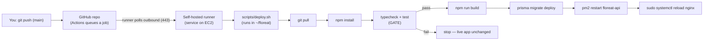

# Floreat — CI/CD Pipeline Guide (Beginner Friendly)

This guide sets up **automatic deployment** for the **Floreat** application on your
existing **single AWS EC2 instance**. After this, pushing code to the `main` branch on
GitHub will **automatically** run the whole update sequence for you — pull, install,
type-check, test, build, migrate the database, restart the backend, and reload Nginx —
so you never have to SSH in and type those commands by hand again.

It assumes you have **already followed the main deployment guide** (`README.md`) and have
a working Floreat install on EC2 (Node app under PM2, PostgreSQL, and Nginx). Like the
README, it spells out **what each command does, why it is needed, what output to expect,
and how to confirm it worked**.

> **Scope for this phase (as requested):**
> - CI/CD is done with **GitHub Actions** and a **self-hosted runner installed on the
>   same EC2 instance**. The runner **polls GitHub outbound**, so we do **not** open any
>   new inbound port and your `SSH from My IP only` firewall rule stays exactly as it is.
> - Every deploy is **gated on tests**: `npm run typecheck` and `npm run test` must pass
>   before anything is built, migrated, or restarted.
> - The app is **built on the EC2 instance** (reusing the swap file from README §6.4),
>   mirroring your current manual flow.
> - We deploy from the **`main`** branch only. Your repository must be **private**
>   (explained in [Section 2](#2-prerequisites) and [Section 8](#8-security)).

---

## Table of contents

1. [How CI/CD fits together (architecture & concepts)](#1-architecture)
2. [Prerequisites](#2-prerequisites)
3. [Prepare the server for automated deploys](#3-prepare-server)
4. [Add the version-controlled deploy script](#4-deploy-script)
5. [Install and register the self-hosted runner](#5-runner)
6. [Add the GitHub Actions workflow](#6-workflow)
7. [First run, verification, migrations & rollback](#7-verify)
8. [Security, troubleshooting & maintenance](#8-security)
9. [Appendix — quick reference & full files](#9-appendix)

---

<a name="1-architecture"></a>
## 1. How CI/CD fits together (architecture & concepts)

### 1.1 What CI/CD means (plain English)

- **CI — Continuous Integration:** every time you push code, an automated system checks
  it (here: type-checking and running the test suite). It catches broken code early.
- **CD — Continuous Deployment:** if those checks pass, the same system automatically
  ships the new code to your server. No manual steps.

Together they turn "SSH in and run six commands" into "push to `main` and wait a minute."

### 1.2 The GitHub Actions vocabulary

- **Workflow** — a YAML file in `.github/workflows/` describing *when* to run and *what*
  to do. Ours is `deploy.yml`.
- **Job** — a group of steps that run on one machine. We have one job: `deploy`.
- **Step** — a single command or action inside a job. Our job has one step: run the
  deploy script.
- **Runner** — the machine that actually executes the job. GitHub offers **hosted**
  runners (throwaway VMs in GitHub's cloud) and **self-hosted** runners (a machine *you*
  own). **We use a self-hosted runner installed on your EC2 instance.**

### 1.3 Why a self-hosted runner (and why it's firewall-friendly)

A GitHub-hosted runner would have to reach your server from the internet — meaning you'd
have to open SSH (port 22) to GitHub's rotating IP ranges or to the whole world. That
weakens the tight `SSH from My IP only` rule from README §4.

A **self-hosted runner runs on the EC2 box itself** and **connects out** to GitHub to ask
"any jobs for me?" (long-polling over HTTPS on port 443, which your outbound rules already
allow). GitHub never initiates a connection *in*. So:

- **No new inbound ports.** Security Group and UFW stay untouched.
- **No SSH keys stored in GitHub.** The runner is already on the server; it just runs the
  deploy script locally.

### 1.4 The end-to-end flow



The important detail: **the tests run before the build, migration, and restart.** If a
test fails, the script aborts *before* touching the running app, so a bad commit never
takes your site down — it just doesn't deploy.

### 1.5 Why the deploy runs in `~/floreat` (not a fresh checkout)

A self-hosted runner normally checks code out into its own working folder (something like
`~/actions-runner/_work/floreat/floreat`). But your PM2 process and Nginx config already
point at `~/floreat/backend/dist` and `~/floreat/frontend/dist`. To avoid moving all
those paths, our workflow **does not** check out code into the runner's folder. Instead it
calls a small committed script (`scripts/deploy.sh`) that updates the **existing**
`~/floreat` checkout in place — exactly the directory your server already serves.

**Verify this section:** You can explain, in one sentence each, what a *workflow*, a
*self-hosted runner*, and the *test gate* are — and why no inbound port is opened.

---

<a name="2-prerequisites"></a>
## 2. Prerequisites

Before wiring up automation, confirm the manual setup works and the repo is ready.

### 2.1 A working manual deployment
You should have completed **README §1–§19**: the app is reachable at `http://YOUR_EC2_IP`,
`pm2 status` shows `floreat-api` **online**, and `sudo systemctl reload nginx` works. CI/CD
only automates the steps you already run by hand (README §21.3) — it does not replace them.

### 2.2 Your repository must be PRIVATE
> **⚠️ Critical security rule.** A self-hosted runner executes whatever a workflow tells
> it to, **on your server**. On a **public** repository, anyone can open a pull request,
> and (with the default fork settings) that untrusted code could run on your EC2 box. So:
> **only attach a self-hosted runner to a private repository**, and only trigger deploys
> on `push` to `main` (never on `pull_request`). This guide does both.

Check/set visibility: GitHub repo → **Settings** → scroll to **Danger Zone** →
**Change repository visibility** → confirm it says **Private**.

### 2.3 Decide the deploy branch
This guide deploys from **`main`**. If your default branch has another name, substitute it
everywhere (in the workflow's `branches:` list and in `scripts/deploy.sh`'s
`DEPLOY_BRANCH`).

### 2.4 Confirm the server checkout points at the right place
SSH into the server (`ssh -i floreat-key.pem ubuntu@YOUR_EC2_IP`) and run:

```bash
git -C ~/floreat remote -v
git -C ~/floreat branch --show-current
```

- **`git -C ~/floreat ...`** runs git *as if* you had `cd`'d into `~/floreat`.
- *Expected output:* `remote -v` shows your GitHub repo URL for `origin` (fetch and push);
  `branch --show-current` prints `main` (or your chosen branch).
- If the branch is wrong: `git -C ~/floreat checkout main`.

**Verify this section:** The repo is **Private**, `origin` points at your GitHub repo, and
the server is on the `main` branch.

---

<a name="3-prepare-server"></a>
## 3. Prepare the server for automated deploys

The runner executes commands in a **non-interactive, non-login shell**. Two things must be
true for the deploy to succeed unattended: the tools must be on its `PATH`, and Nginx must
reload **without** asking for a password.

### 3.1 Confirm node, npm and pm2 are available
SSH in and run:

```bash
which node npm pm2
node -v
pm2 -v
```

- *Expected output:* a path for each of `node`, `npm`, `pm2` (e.g. `/usr/bin/node`,
  `/usr/bin/npm`, `/usr/lib/node_modules/pm2/bin/pm2` or `/usr/local/bin/pm2`), plus their
  versions. Node was installed system-wide from NodeSource (README §7) and PM2 globally
  with `sudo npm install -g pm2` (README §15.1), so both are normally on the PATH for all
  users — including the runner.
- If any command prints nothing, see the **`pm2`/`node` not found** row in the
  [troubleshooting table](#8-troubleshooting) for the PATH fix.

### 3.2 Allow the runner to reload Nginx without a password
The deploy script's last step is `sudo systemctl reload nginx`. Normally `sudo` prompts
for a password — but the runner can't type one. We grant passwordless sudo for **only that
one command** (nothing else), which is safe and minimal.

First, find the exact path to `systemctl` (so the sudoers rule matches precisely):

```bash
which systemctl        # usually /usr/bin/systemctl
```

Now open a dedicated sudoers file with the safe editor (`visudo` checks syntax before
saving — a typo in sudoers can lock you out, so never edit it with a plain editor):

```bash
sudo visudo -f /etc/sudoers.d/floreat-deploy
```

Add this single line (use the `systemctl` path from above if it differs):

```sudoers
ubuntu ALL=(root) NOPASSWD: /usr/bin/systemctl reload nginx
```

Save and exit (in nano: **Ctrl+O**, **Enter**, **Ctrl+X**).

**What it does / why:** it lets user `ubuntu` run *exactly* `sudo systemctl reload nginx`
(and nothing else) without a password. Because the runner runs as `ubuntu`, the deploy can
reload Nginx unattended. It grants **no** other root powers.

### 3.3 Verify the passwordless reload

```bash
sudo -n systemctl reload nginx
```

- **`-n`** means "non-interactive: fail instead of prompting for a password."
- *Expected output:* **nothing** (silent success), returning straight to the prompt. That
  proves the rule works. If you instead see `sudo: a password is required`, the sudoers
  line doesn't match — re-check the `systemctl` path and the exact spelling.

**Verify this section:** `which node npm pm2` prints all three paths, and
`sudo -n systemctl reload nginx` returns silently with no password prompt.

---

<a name="4-deploy-script"></a>
## 4. Add the version-controlled deploy script

Rather than cramming the deploy commands into the workflow, we keep them in a script
**committed to the repo** at `scripts/deploy.sh`. Benefits: it's version-controlled, you
can run it by hand for testing or rollback, and the workflow stays a one-liner.

This file is already included in the repository. Its full contents are in the
[appendix](#9-deploy-sh); here's what each part does.

### 4.1 The strict-mode header

```bash
#!/usr/bin/env bash
set -euo pipefail
```

- **`set -e`** — abort the whole script the moment any command returns non-zero (fails).
- **`set -u`** — treat an unset variable as an error (catches typos).
- **`set -o pipefail`** — a pipeline (`a | b`) fails if *any* stage fails, not just the
  last. **Why it matters here:** it's what makes the test gate real — if `npm run test`
  exits non-zero, the script stops immediately and never reaches build/migrate/restart.

### 4.2 The safe-ordered sequence
The script runs these in order, logging each with a timestamp:

1. `git fetch` + `git checkout main` + `git pull --ff-only origin main` — get the newest
   code. `--ff-only` refuses to auto-merge if histories diverged (it stops instead of
   creating a surprise merge commit on the server).
2. `npm install` — install any new/changed dependencies across all workspaces.
3. `npm run typecheck` — **gate 1/2**.
4. `npm run test` — **gate 2/2**. If either gate fails, the script exits here.
5. `npm run build` — build `shared` → `frontend` → `backend` (README §14).
6. `npm run db:migrate:deploy --workspace backend` — apply committed migrations
   (production-safe; never resets data).
7. `pm2 restart floreat-api --update-env` — restart the backend on the new build;
   `--update-env` re-reads `backend/.env`.
8. `sudo systemctl reload nginx` — pick up the fresh `frontend/dist` (uses the
   passwordless rule from §3.2).

> **Why this order is safe:** the two gates (steps 3–4) run **before** anything that
> touches the live app (steps 5–8). A failing test aborts the deploy while the currently
> running `floreat-api` and the existing `frontend/dist` are still in place — so a bad
> commit simply doesn't ship; it never breaks what's already live.

### 4.3 Make the script executable and smoke-test it
On the server, pull the branch that contains the script (or copy it up), then:

```bash
chmod +x ~/floreat/scripts/deploy.sh     # mark it runnable
bash ~/floreat/scripts/deploy.sh          # run a full deploy by hand, once
```

- **`chmod +x`** sets the executable bit so it can be run directly. (Committing it from
  Windows can drop this bit; run `git update-index --chmod=+x scripts/deploy.sh` once and
  commit, so the bit is preserved in git.)
- *Expected output:* the `=== [deploy] HH:MM:SS: ...` log lines march through fetch →
  install → typecheck → test → build → migrate → restart → reload, ending with
  **`Deploy complete ✅`** and exit code 0. Confirm with `echo $?` printing `0`.
- **Why run it by hand first:** this proves the script works end-to-end *before* the runner
  ever calls it. If something is wrong (a missing PATH entry, the sudo rule, a failing
  test), you see it now, interactively, instead of in a CI log.

**Verify this section:** `bash ~/floreat/scripts/deploy.sh` completes with
`Deploy complete ✅` and `echo $?` prints `0`.

---

<a name="5-runner"></a>
## 5. Install and register the self-hosted runner

Now we install the GitHub Actions runner agent on the EC2 instance and register it with
your repository. GitHub gives you the **exact commands** (including a short-lived token) on
a setup page — you copy them and run them on the server.

### 5.1 Open the "New self-hosted runner" page
In your browser: GitHub repo → **Settings** → **Actions** → **Runners** → **New
self-hosted runner**. Choose:
- **Runner image:** **Linux**
- **Architecture:** **x64**

GitHub now shows a **Download** section and a **Configure** section with copy-paste
commands. **Use the commands from your own page** — they contain a token unique to your
repo that expires in about an hour.

> **Do not paste that registration token into any file or commit it.** It's meant to be
> typed once on the server. This guide never hardcodes it.

### 5.2 Download the runner (run GitHub's commands on the server)
SSH into the instance and run the **Download** block from your page. It looks roughly like
this (versions/hashes will differ — **use yours**):

```bash
# create a folder and download the runner
mkdir -p ~/actions-runner && cd ~/actions-runner
curl -o actions-runner-linux-x64.tar.gz -L https://github.com/actions/runner/releases/download/vX.Y.Z/actions-runner-linux-x64-X.Y.Z.tar.gz
tar xzf ./actions-runner-linux-x64.tar.gz
```

- *Expected output:* `curl` shows a download progress bar; `tar` extracts files, leaving
  `config.sh`, `run.sh`, and `svc.sh` in `~/actions-runner`.

### 5.3 Configure (register) the runner
Run the **Configure** command from your page (again, **your** token):

```bash
./config.sh --url https://github.com/yaseen-kc/floreat --token XXXXXXXXXXXXXXXXXXXX
```

- It asks a few questions — accept the defaults by pressing **Enter**:
  - **runner group** → Default
  - **name of runner** → the hostname (fine)
  - **labels** → the defaults already include `self-hosted`, `linux`, and `x64` (these are
    what our workflow's `runs-on: [self-hosted, linux]` matches — don't remove them)
  - **work folder** → `_work` (fine)
- *Expected output:* `√ Connected to GitHub`, then `√ Runner successfully added` and
  `√ Runner connection is good`.

### 5.4 Install it as a service (so it starts on boot)
Running `./run.sh` would work only while your SSH session is open. Installing it as a
**systemd service** keeps it running in the background and restarts it after a reboot —
just like PM2 does for the backend.

```bash
sudo ./svc.sh install ubuntu     # install the service, running as user 'ubuntu'
sudo ./svc.sh start              # start it now
sudo ./svc.sh status             # check it
```

- **`install ubuntu`** registers the service under the `ubuntu` user, so the deploy runs
  with the same PATH and permissions you tested in Sections 3–4 (including the Nginx sudo
  rule and PM2 access).
- *Expected output of `status`:* a line showing the service **active (running)** and a
  recent "Listening for Jobs" message.

### 5.5 Confirm the runner is online in GitHub
Back on the **Settings → Actions → Runners** page, your runner now appears with a
**green dot** and status **Idle**. Idle means "connected and waiting for jobs."

**Verify this section:** `sudo ./svc.sh status` shows **active (running)**, the Runners
page shows your runner **Idle / green**, and after a `sudo reboot` (wait ~60s, reconnect)
it returns to Idle on its own.

---

<a name="6-workflow"></a>
## 6. Add the GitHub Actions workflow

The workflow file tells GitHub *when* to deploy and *what* to run. It's already in the repo
at `.github/workflows/deploy.yml`; its full contents are in the [appendix](#9-workflow).
Here's what each key does.

### 6.1 When it runs

```yaml
on:
  push:
    branches: [main]
```

- Runs **only** on a push to `main`. Pull requests, other branches, and tags do **not**
  deploy. This is the key safety control for a self-hosted runner (see §2.2 / §8).

### 6.2 One deploy at a time

```yaml
concurrency:
  group: floreat-deploy
  cancel-in-progress: false
```

- If you push twice quickly, the second run **waits** for the first to finish rather than
  running on top of it. We keep `cancel-in-progress: false` on purpose: cancelling a deploy
  midway (during a build or a database migration) could leave the server half-updated.

### 6.3 Where it runs, and what it does

```yaml
jobs:
  deploy:
    runs-on: [self-hosted, linux]
    steps:
      - name: Run deploy script on the server
        run: bash /home/ubuntu/floreat/scripts/deploy.sh
```

- **`runs-on: [self-hosted, linux]`** — target *your* runner (matches the labels it
  registered with). If this doesn't match, the job sits "Queued" forever.
- The single step calls the committed deploy script. Note we **don't** use
  `actions/checkout` — the script does its own `git pull` inside `~/floreat` (see §1.5).
- **No secrets or SSH keys** appear anywhere: the runner is already on the box.

### 6.4 Put it live
Commit `.github/workflows/deploy.yml` and `scripts/deploy.sh` to `main` and push. GitHub
detects the workflow automatically — no "enable" button needed. It appears under the repo's
**Actions** tab.

**Verify this section:** The **Actions** tab lists a **Deploy to EC2** workflow, and
opening it shows the run triggered by your push.

---

<a name="7-verify"></a>
## 7. First run, verification, migrations & rollback

### 7.1 Trigger a deploy
Make a tiny, safe change on `main` (e.g. edit a comment or the README), commit, and push:

```bash
git commit -am "chore: test CI/CD pipeline" && git push origin main
```

### 7.2 Watch it run
GitHub repo → **Actions** → click the running **Deploy to EC2** workflow → click the
**deploy** job. You'll see **live logs** streaming the same `=== [deploy] ...` lines your
manual run produced, ending in **`Deploy complete ✅`** and a green check on the job.

- If the job stays **Queued**, the runner isn't picking it up — check `sudo ./svc.sh
  status` and that labels match (§8).

### 7.3 Verify on the server and in the browser

```bash
pm2 status                     # floreat-api should be 'online', restart count +1
```

- Then hard-refresh `http://YOUR_EC2_IP` (**Ctrl+F5**) and confirm your change is live.

### 7.4 How database migrations stay safe
The deploy runs `prisma migrate deploy` (step 6) **only after** type-check and tests pass
(steps 3–4). `migrate deploy` applies **already-committed** migrations in order and is the
production-safe command — it never generates new migrations and never resets data (README
§13.2). Because it runs after the gate, a commit with failing tests never reaches the
migration step, so your database is only ever touched by code that passed CI.

> **Tip:** commit your Prisma migration files (`backend/prisma/migrations/…`) along with
> the schema change. `migrate deploy` can only apply migrations that are in the repo.

### 7.5 Rolling back a bad deploy
If a deploy shipped something you want to undo, roll the server back to the previous commit
and re-run the same script:

```bash
# on the server
cd ~/floreat
git log --oneline -5                         # find the last good commit's SHA
git checkout <previous-good-sha>             # move the working tree back
bash scripts/deploy.sh                        # rebuild/restart on the old code
```

- To make `main` itself point back, do a `git revert <bad-sha>` locally and push — that
  triggers a clean forward deploy through the pipeline (preferred over force-pushing).
- **Database rollbacks are different:** migrations aren't automatically reversed. If a bad
  migration is involved, restore from a backup (README §21.4) — which is why regular
  backups matter.

**Verify this section:** A pushed commit auto-deploys end-to-end (green job +
`Deploy complete ✅`), the change is visible in the browser, and `pm2 status` shows the
restart — all with **zero** manual SSH.

---

<a name="8-security"></a>
## 8. Security, troubleshooting & maintenance

### 8.1 Security hardening (do these)
- **Private repo only.** Never attach this runner to a public repo (§2.2).
- **Deploy on `push` to `main` only.** Do not add `pull_request` triggers — that would let
  PR code run on your server.
- **Least-privilege sudo.** The runner can run *only* `systemctl reload nginx` as root
  (§3.2). Don't broaden it. Don't run the runner service as `root`.
- **Protect secrets.** `backend/.env` and `frontend/.env` stay on the server, git-ignored
  (README §11). The pipeline never prints them — keep it that way; don't add `cat .env` or
  `env` dumps to the workflow or script.
- **Keep the runner updated.** GitHub auto-updates self-hosted runners by default; leave
  that on. Review the Runners page occasionally.
- **Branch protection (optional, recommended).** Protect `main` (require PR review) so only
  vetted code ever reaches the deploy trigger.

<a name="8-troubleshooting"></a>
### 8.2 Troubleshooting

First places to look: the **Actions** tab (live/most-recent logs) and, on the server,
`sudo ./svc.sh status` plus `~/actions-runner/_diag/` logs.

| Symptom | Likely cause | Fix |
|---|---|---|
| Job stuck **Queued** forever | Runner offline, or `runs-on` labels don't match | `sudo ~/actions-runner/svc.sh status`; ensure it's **active/Idle**. Confirm the runner's labels include `self-hosted` and `linux`. |
| Runner shows **Offline** in GitHub | Service stopped / instance rebooted before service install | `sudo ~/actions-runner/svc.sh start`; ensure you ran `svc.sh install` (§5.4) so it auto-starts. |
| Deploy fails at Nginx step: **`sudo: a password is required`** | The passwordless sudo rule is missing/mismatched | Redo §3.2; confirm `sudo -n systemctl reload nginx` is silent. Match the exact `systemctl` path. |
| Log: **`pm2: command not found`** or **`node: command not found`** | The service's PATH lacks the tool's directory | Find it (`which pm2`), then either call it by absolute path in `scripts/deploy.sh`, or add `export PATH="$PATH:/usr/local/bin"` near the top of the script. Re-run. |
| Deploy fails at **test/typecheck** step | A real test/type failure (the gate working) | Good — the live app was left untouched. Fix the code, push again. |
| `npm install` / `npm run build` **Killed** | Out of memory (t2.micro) | Ensure swap is enabled (README §6.4), then re-run the workflow. |
| **`permission denied`** running the script | Executable bit missing | `chmod +x ~/floreat/scripts/deploy.sh`; commit the bit with `git update-index --chmod=+x scripts/deploy.sh`. |
| Deploy fails at **`git pull --ff-only`** | Server history diverged from remote (e.g. local edits/commits on the box) | On the server: `git -C ~/floreat status`; discard stray local changes (`git -C ~/floreat checkout -- .`) or reconcile, then re-run. |
| Migration step errors | Missing migration files, or DB permission | Ensure `backend/prisma/migrations/` is committed; re-check `DATABASE_URL` and schema grants (README §9.2 / §20). |

### 8.3 Maintenance

```bash
# Runner service control (from ~/actions-runner)
sudo ./svc.sh status        # is it running?
sudo ./svc.sh stop          # stop temporarily (pauses deploys)
sudo ./svc.sh start         # resume

# Runner diagnostic logs
ls -t ~/actions-runner/_diag/     # newest .log first; open with 'less'
```

- **Update the runner:** normally automatic. To update manually, `sudo ./svc.sh stop`,
  re-download the latest release into `~/actions-runner` (as in §5.2), then
  `sudo ./svc.sh start`.
- **Remove / re-register a runner:** `sudo ./svc.sh stop && sudo ./svc.sh uninstall`, then
  `./config.sh remove --token <new-token-from-GitHub>`. Register again with §5.3 if needed.
- **Rotate nothing manually:** there are no long-lived deploy secrets to rotate — the
  registration token was one-time, and there are no SSH keys in GitHub.

**Verify this section:** You can stop and start the runner, find its diagnostic logs, and
you've confirmed the trigger is `push`-to-`main` only on a **private** repo.

---

<a name="9-appendix"></a>
## 9. Appendix — quick reference & full files

### 9.1 Quick command reference

| Task | Command |
|---|---|
| Deploy manually (also for rollback) | `bash ~/floreat/scripts/deploy.sh` |
| Runner status | `sudo ~/actions-runner/svc.sh status` |
| Start / stop runner | `sudo ~/actions-runner/svc.sh start` / `stop` |
| Test passwordless Nginx reload | `sudo -n systemctl reload nginx` |
| Backend status after deploy | `pm2 status` |
| Watch a live deploy | GitHub repo → **Actions** → latest **Deploy to EC2** run |
| Roll back to a commit | `cd ~/floreat && git checkout <sha> && bash scripts/deploy.sh` |

<a name="9-workflow"></a>
### 9.2 `.github/workflows/deploy.yml`

```yaml
name: Deploy to EC2

on:
  push:
    branches: [main]

concurrency:
  group: floreat-deploy
  cancel-in-progress: false

jobs:
  deploy:
    runs-on: [self-hosted, linux]
    steps:
      - name: Run deploy script on the server
        run: bash /home/ubuntu/floreat/scripts/deploy.sh
```

<a name="9-deploy-sh"></a>
### 9.3 `scripts/deploy.sh`

```bash
#!/usr/bin/env bash
set -euo pipefail

APP_DIR="${APP_DIR:-/home/ubuntu/floreat}"
DEPLOY_BRANCH="${DEPLOY_BRANCH:-main}"
PM2_APP="${PM2_APP:-floreat-api}"

log() { printf '\n=== [deploy] %s: %s\n' "$(date +%H:%M:%S)" "$1"; }

cd "$APP_DIR"

log "Fetching latest code ($DEPLOY_BRANCH)"
git fetch origin "$DEPLOY_BRANCH"
git checkout "$DEPLOY_BRANCH"
git pull --ff-only origin "$DEPLOY_BRANCH"

log "Installing dependencies (all workspaces)"
npm install

log "Type-checking (gate 1/2)"
npm run typecheck

log "Running tests (gate 2/2)"
npm run test

log "Building shared + frontend + backend"
npm run build

log "Applying database migrations (production-safe)"
npm run db:migrate:deploy --workspace backend

log "Restarting the backend under PM2"
pm2 restart "$PM2_APP" --update-env

log "Reloading Nginx to serve the fresh frontend build"
sudo systemctl reload nginx

log "Deploy complete ✅"
```

### 9.4 Sudoers rule (`/etc/sudoers.d/floreat-deploy`)

```sudoers
ubuntu ALL=(root) NOPASSWD: /usr/bin/systemctl reload nginx
```

**You're done.** With the runner installed and the workflow committed, every push to
`main` now type-checks, tests, builds, migrates, restarts, and reloads — automatically,
with the live app protected by the test gate. When you later add HTTPS and a domain
(README's next phase), the pipeline keeps working unchanged; you'd only add a
`sudo systemctl reload nginx` equivalent for any new certs — which this already does.
